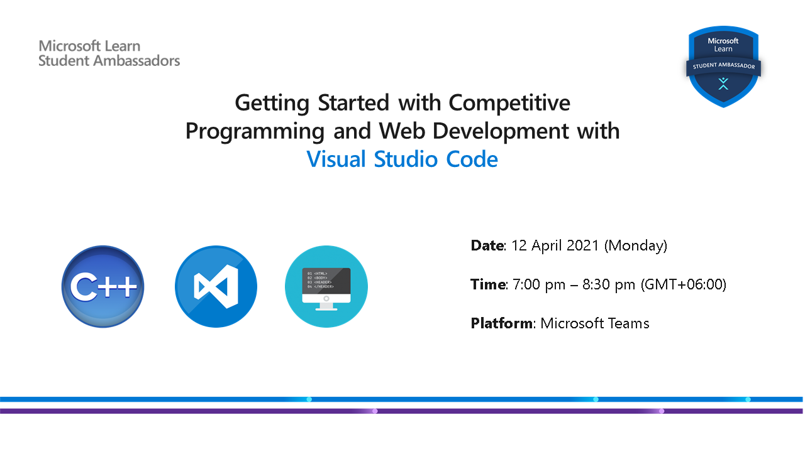

# Getting Started with Competitive Programming and Web Development with Visual Studio Code
 

  

 

## :scroll: Event Snippet

In this event, you will learn how you can kickstart your journey as a competitive programmer. You will also learn how you can start building a website very easily with the help of some cool **Visual Studio Code** extensions. [VS Code](https://code.visualstudio.com) is a code editor by **Microsoft** that supports writing codes in multiple programming languages (C++, Java, Python, Javascript etc.). 

In this event, you will learn how you can use the unique features of VS Code for competitive programming and web development.

**The event covers the following topics:**
- Introduction to **Competitive Programming** 
- Overview of **Online Judges**
- Competitive programming problems
- Types of limits and errors
- International Collegiate Programming Contest (**ICPC**)
- Programming languages for competitive programming  
- How to setup C++ environment in VS Code
- Tips and resources for beginners
- Introduction to **Web Development**
- **VS Code Extensions** for web development

## :books: Event Handbook 
### Grab the **exclusive handbook** and set up your VS Code for C++ programming environment today!

 

## :movie_camera: Event Recording

[Playlist](https://youtu.be/YtDXX9l8yGk) available on **YouTube**

## :star: Credits
Speakers and Organizers :  
		- [Shoaib Ahmed](https://github.com/edge555) (Ambassador)  
		- [Nawrin Tabassum](https://github.com/Nawrin14) (Ambassador)  

